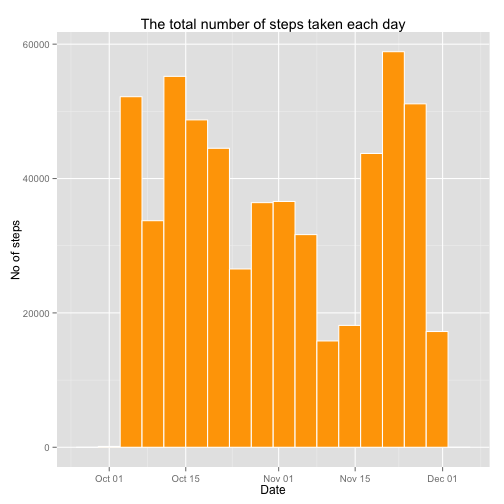
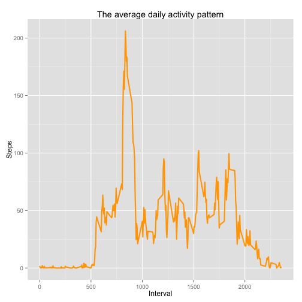
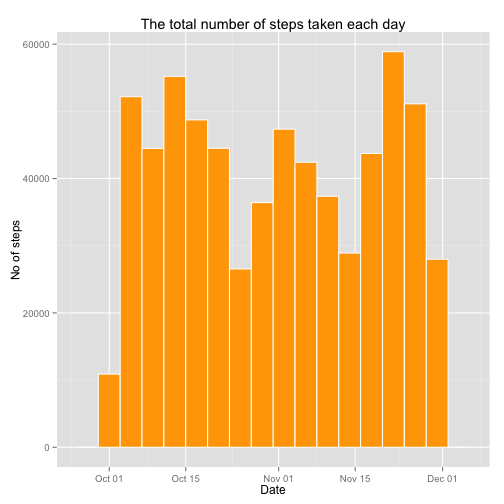
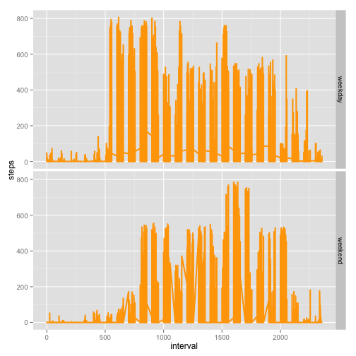

# Reproducible Research: Peer Assessment 1
==========================================

# Loading and preprocessing the data
Lets load and preprocess the data.


```r
# load datset into R
activity = read.csv("activity.csv")
```


```r
# check summary and structure of the dataset
summary(activity)
```

```
##      steps               date          interval   
##  Min.   :  0.0   2012-10-01:  288   Min.   :   0  
##  1st Qu.:  0.0   2012-10-02:  288   1st Qu.: 589  
##  Median :  0.0   2012-10-03:  288   Median :1178  
##  Mean   : 37.4   2012-10-04:  288   Mean   :1178  
##  3rd Qu.: 12.0   2012-10-05:  288   3rd Qu.:1766  
##  Max.   :806.0   2012-10-06:  288   Max.   :2355  
##  NA's   :2304    (Other)   :15840
```

```r
str(activity)
```

```
## 'data.frame':	17568 obs. of  3 variables:
##  $ steps   : int  NA NA NA NA NA NA NA NA NA NA ...
##  $ date    : Factor w/ 61 levels "2012-10-01","2012-10-02",..: 1 1 1 1 1 1 1 1 1 1 ...
##  $ interval: int  0 5 10 15 20 25 30 35 40 45 ...
```

```r
# make "date" variable R friendly
activity$date <- as.Date(activity$date, "%Y-%m-%d")
```

# What is mean total number of steps taken per day?


```r
# aggrigation, total steps per day
activity.totalSteps <- aggregate(steps ~ date, data = activity, sum, na.rm= TRUE)
```


```r
# histogram of the total number of steps taken each day
library(ggplot2)
a <- ggplot(activity.totalSteps, aes(x = date)) # with ggplot2
a + geom_histogram(aes(weight = steps), binwidth = 4, color = "white", fill = "orange") +  
         ggtitle("The total number of steps taken each day") +
         ylab("No of steps") +
         xlab("Date") 
```

 


```r
# mean and median total number of steps taken per day
meanSteps <- mean(activity.totalSteps$steps)
medianSteps <- median(activity.totalSteps$steps)
```
Mean value of total number of steps is **1.0766 &times; 10<sup>4</sup>**.  
Median value of total number of steps is **10765**

# What is the average daily activity pattern?

```r
# calculate average steps taken per day.
activity.avgSteps = aggregate(steps ~ interval, activity, mean, na.rm= TRUE)
```


```r
# generate activity pattern / Make a time series plot
b <- ggplot(activity.avgSteps, aes(x = interval, y = steps))
b + geom_line(color = "orange", lwd=1) + 
        ggtitle("The average daily activity pattern") +
        xlab("Interval") + 
        ylab("Steps")
```

 


```r
# maximum 5 minute interval
maxIndex<- which.max(activity.avgSteps$steps)
maxInterval<- activity.avgSteps$interval[which.max(activity.avgSteps$steps)]
maxSteps <- max(activity.avgSteps$steps)
```

Maximum interval information is given below  

```r
# Index: 
maxIndex
```

```
## [1] 104
```

```r
# Interval: 
maxInterval
```

```
## [1] 835
```

```r
# Steps
maxSteps
```

```
## [1] 206.2
```


# Imputing missing values
We will impute the dataset on the basis of mean steps calculation.


```r
# number of missing values in the dataset
missingValues <- nrow(activity) - nrow(na.omit(activity))
missingValues
```

```
## [1] 2304
```


```r
# create a new data frame for imputation
activity.imp <- activity
# impute on the basis of mean steps 
activity.imp$steps[is.na(activity.imp$steps)] <- tapply(activity.imp$steps, activity.imp$interval, mean, na.rm = T)
summary(activity.imp)
```

```
##      steps            date               interval   
##  Min.   :  0.0   Min.   :2012-10-01   Min.   :   0  
##  1st Qu.:  0.0   1st Qu.:2012-10-16   1st Qu.: 589  
##  Median :  0.0   Median :2012-10-31   Median :1178  
##  Mean   : 37.4   Mean   :2012-10-31   Mean   :1178  
##  3rd Qu.: 27.0   3rd Qu.:2012-11-15   3rd Qu.:1766  
##  Max.   :806.0   Max.   :2012-11-30   Max.   :2355
```

```r
summary(activity)
```

```
##      steps            date               interval   
##  Min.   :  0.0   Min.   :2012-10-01   Min.   :   0  
##  1st Qu.:  0.0   1st Qu.:2012-10-16   1st Qu.: 589  
##  Median :  0.0   Median :2012-10-31   Median :1178  
##  Mean   : 37.4   Mean   :2012-10-31   Mean   :1178  
##  3rd Qu.: 12.0   3rd Qu.:2012-11-15   3rd Qu.:1766  
##  Max.   :806.0   Max.   :2012-11-30   Max.   :2355  
##  NA's   :2304
```

```r
nrow(activity.imp) - nrow(na.omit(activity.imp))
```

```
## [1] 0
```


# histogram of the total number of steps taken each day with no missing values.

```r
activity.imp.totalSteps <- aggregate(steps ~ date, data = activity.imp, sum)
c <- ggplot(activity.imp.totalSteps, aes(x = date)) 
c + geom_histogram(aes(weight = steps), binwidth = 4, color = "white", fill = "orange") +  
        ggtitle("The total number of steps taken each day") +
        ylab("No of steps") +
        xlab("Date") 
```

 

# mean and meadin with no missing values

```r
mean(activity.imp.totalSteps$steps)
```

```
## [1] 10766
```

```r
median(activity.imp.totalSteps$steps)
```

```
## [1] 10766
```


# Are there differences in activity patterns between weekdays and weekends?

```r
# make use of weekdays() to create a factor variable "days".
activity.imp$days <-factor(weekdays(activity.imp$date))

# assign two levels to factor variable "days" , weekday and weekend.        
levels(activity.imp$days) <- c("weekday", "weekday", "weekend", "weekend", "weekday", "weekday", "weekday")

# panel plot
d <- ggplot(activity.imp, aes(x= interval, y=steps)) + geom_line(size=1, color="orange")
d  + facet_grid(days ~ .) # add facets
```

 


